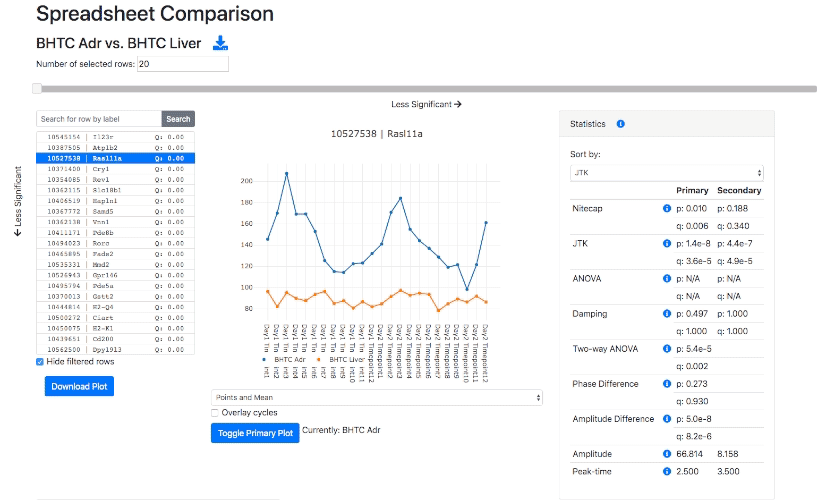

# Nitecap

Explore, analyze, and share high-throughput omics circadian datasets through an easy-to-use [web interface](https://nitecap.org).

 
  

[**Nitecap**](https://nitecap.org) is an exploratory circadian data analysis tool aimed at high-throughput omics data.
It provides a web-interface to examine your dataset with highly-responsive visualizations, allowing the easy viewing of hundreds or thousands of genes or other features.
Nitecap computes some standard rhythmicity tests for you, including cosinor, JTK, ARSER, Lomb-Scargle, and RAIN, and it implements several tests to compare differential rhythmicity across two conditions (such as phase differences).

Nitecap allows users to perform gene ontology (GO) pathway analyses that update in real time to changes of parameters such as significance cutoffs or filters. This allows one to assess the impact of the full range of cutoffs on the pathway results.

You can read the paper [here](https://www.ncbi.nlm.nih.gov/pmc/articles/PMC9003665/).

## Implementation
[Nitecap.org](https://nitecap.org) consists of a web server and a serverless computational backend.
Algorithms such as JTK, ARSER, Lomb-Scargle, and RAIN which potentially require substantial computation time are run in the serverless backend,
while others are run on the server and in the user's web browser.

### 1. Computational backend
Algorithms are executed in Lambda functions which are written in Python.
Algorithms written in R are executed using [rpy2](https://rpy2.github.io/).
The code for the computational backend and algorithms can be found in the [src/computation](/src/computation/) directory.
Some algorithms (such as PCA) are part of the server and some are running in the user's web browser.

### 2. Server
The server is imagined as a containerized application.
The code for the server resides in the [src/server](src/server/)</code> directory.

### 3. Infrastructure
The infrastructure is specified in TypeScript using AWS Cloud Development Kit ([CDK](https://aws.amazon.com/cdk/)).
The code describing infrastructure can be found in the [lib](lib/) directory.

## Contributions and support

Nitecap is developed at the <a href="http://bioinf.itmat.upenn.edu/">Institute for Translational Medicine and Therapeutics Bioinformatics, University of Pennsylvania</a>. For any questions or comments, feel free to contact us by email <a href="mailto:admins@nitecap.org">admins@nitecap.org</a>.

## License

GNU General Public License, version 3
